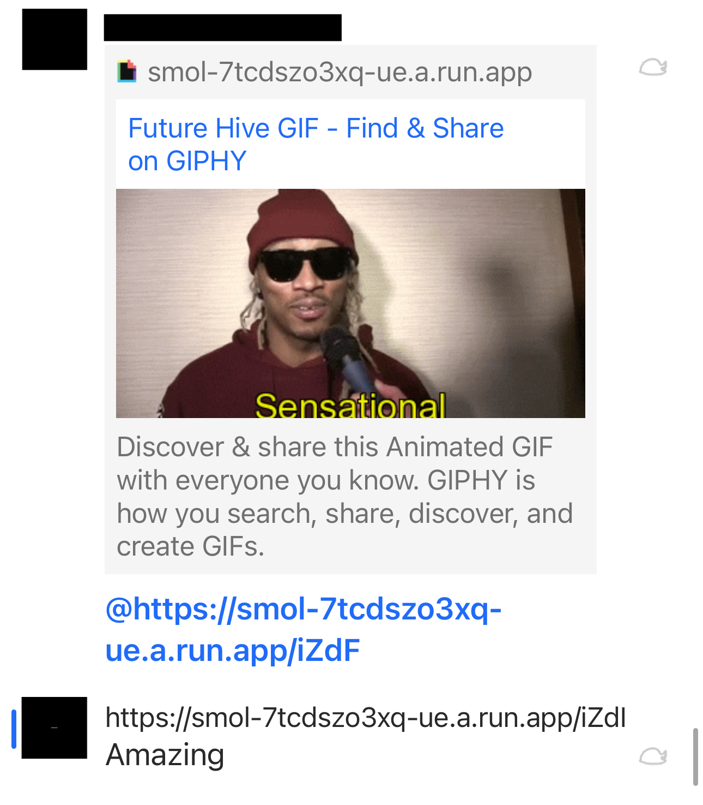

# Smol
### Introduction
Smol is a URL shortening service like tinyURL.

A URL Shortener Service is a tool designed to convert long URLs into shorter, more manageable links. These shortened links redirect users to the original web addresses.

### Q: Why make a URL Shortening Service?

**A:** Early 2024 my friends and I discovered a bug (feature?) in groupMe. If you make your name a link then content preview is activated whenever someone trys to "@" you.

There is a size limit for profile names however, so many of my friends and my favorite links would not work. To get around this limitation, I developed a tinyURL service to create a small enough URL such that it could be my profile name on GroupMe. The application is an API hosted on GCP cloud run built using FastAPI that sends a 302 redirect if the id of the url matches a record in a NoSQL database (Firestore). 

### Key Features
- **URL Shortening:** Convert a standard URL into a brief, unique link.

- **Redirection:** Use the shortened link to redirect users to the intended original URL.

## GroupMe Defect Write Up & Solution Evidence
### Example. The name in GroupMe is the URL to Rick Astley’s “Never Gonna Give You Up”. Trying to @ him results in the Youtube URL Content preview.

### I wanted to make it so that whenever someone trys to @ me a gif hosted on giphy.com would show up. However the URL was too long for GroupMe to allow it.

### The solution was to make a simple URL shortener and it worked!

## Technical Stack

**Features:**
- Python 
- [FastAPI](https://fastapi.tiangolo.com) - API Implementation

**Backend:**
- [GCP Cloud Run](https://cloud.google.com/run/?utm_source=google&utm_medium=cpc&utm_campaign=na-US-all-en-dr-bkws-all-all-trial-e-dr-1707554&utm_content=text-ad-none-any-DEV_c-CRE_665665924930-ADGP_Hybrid+%7C+BKWS+-+MIX+%7C+Txt-Serverless+Computing-Cloud+Run-KWID_43700078963879198-aud-2232802566172:kwd-353039629183&utm_term=KW_cloud+run-ST_cloud+run&gad_source=1&gclid=Cj0KCQjwk6SwBhDPARIsAJ59GwdlGxqjWRql66rOES5EHR1NlR7_3Pd18E8vnSWO3bCrvyXOKSPGV4UaAh7QEALw_wcB&gclsrc=aw.ds&hl=en) - host server
- [uvicorn](https://www.uvicorn.org) - ASGI web server
- [GCP Firestore](https://cloud.google.com/firestore?hl=en) - NoSQL database

**Deployment:**
- Docker
- GCP Artifact Registry - Docker Image Store for Cloud Run deployment

## Development Setup
Follow these steps to set up your local development environment:

1. Clone the repository using:

    `git clone <repository-url>`

2. Install the required packages by running:

    `pip install -r requirements.txt`

3. Launch the service with:

    `uvicorn main:app --reload`

Your local server should now be accessible at `http://localhost:8000`.
