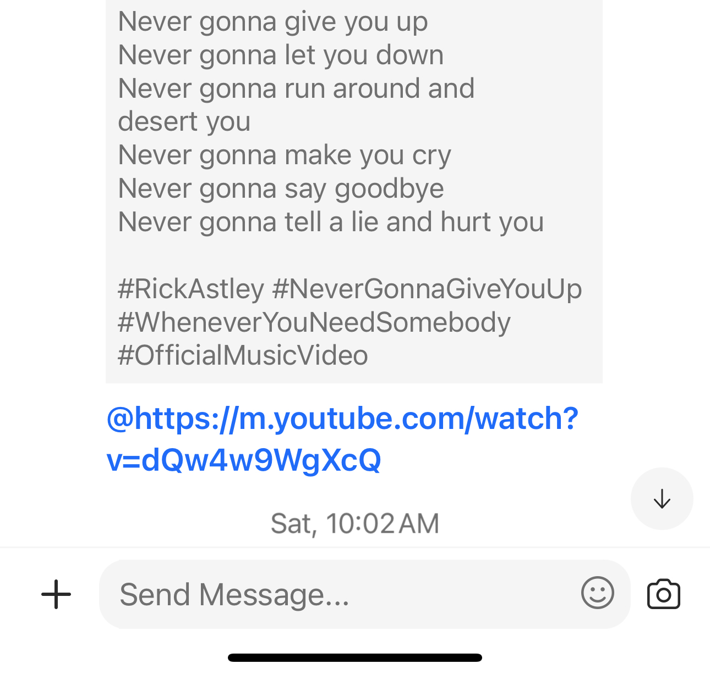
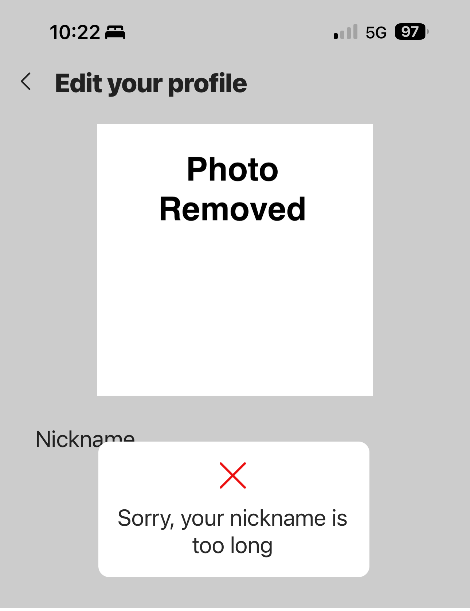

# Smol
Smol is a URL shortening service like tinyURL. 

## Why make a URL Shortening Service?

Early 2024 my friends and I discovered a bug (feature?) in groupMe. If you make your name a link then content preview is activated whenever someone trys to "@" you.

### Ex. Person's name in GroupMe is the URL to Rick Astley’s “Never Gonna Give You Up” @ing him results in the Youtube URL Content preview.

### I wanted to make it so that whenever someone @ me that this gif would show up

### However the URL was too long for GroupMe to allow it.

### Solution 

To get around this limitation, I developed a tinyURL service to create a small enough URL such that it could be my profile name. 

The application is a simple GCP cloud run app built using FastAPI that sends a 302 redirect if the id of the url matches a record in the NoSQL database.

## Technical Stack

Features:
- Python, FastAPI

Backend:
- GCP Cloud Run

Deployment:
- Docker

## Security
I floated originally deploying GCP API Gateway in front of my cloud run container instead of exposing it directly to the internet. I choose instead to keep it simple by exposing it directly. This did mean however I had to consider several security concerns:
- Authentication
- Authorization
- Input Validation
- Rate Limiting 
- Dependency Management
- Secure Deployment Configurations
    - Environment Variables
    - Least Privilege
    - Network Security
